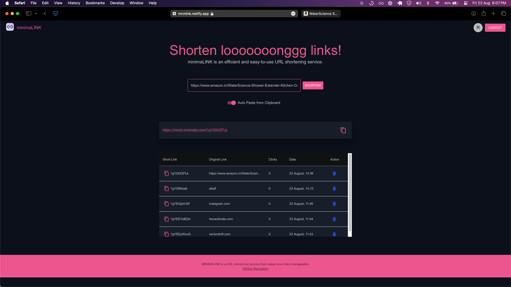

# 🔗 minimaLINK
minimaLINK is a URL shortening service that takes long URLs and creates much shorter, manageable URLs. 



This project is built using Node.js for the backend and PostgreSQL for the database, and features a simple yet elegant frontend with dark theme design.


## Demo

You can check out the live demo - https://mnmlnk.netlify.app.


## Features

### Frontend (React.js)
- **Dark-Themed UI**: The application features a beautiful dark theme with a carefully chosen color palette and accent colors to ensure a professional and visually appealing user experience.
- **Responsive Design**: Built with Material-UI, the frontend is fully responsive, ensuring compatibility across all devices.
- **Interactive Components**:
  - **Header and Footer**: The app includes a fixed header and footer, enhancing navigation and branding.
  - **Typography and Layout**: Elegant use of typography and layout components to ensure readability and a modern look.
  - **Shortened URL Display**: The shortened URL is displayed in a card format with a "Copy to Clipboard" icon, making it user-friendly.
  - **Loading Indicators**: A loading progress indicator is displayed when the user clicks the "Shorten URL" button, providing feedback while the link is being processed.
  - **Alerts**: Integrated Material-UI alert system to provide feedback on success or error states in a polished manner.

### Backend (Express.js)
- **RESTful API**: The backend is built using Express.js, offering a clean and structured RESTful API for URL shortening and redirection.
- **PostgreSQL Integration**: Robust database management with PostgreSQL, including dynamic querying to handle URL storage and retrieval efficiently.
- **Base62 Encoding**: Custom implementation of Base62 encoding for creating short and unique URL identifiers.
- **Error Handling**: Comprehensive error handling ensures stability and reliability of the application.

## Deployment
- **Netlify**: The frontend is deployed on Netlify, ensuring fast and scalable hosting.
- **Environment Variables**: The application is configured using environment variables for sensitive information, ensuring security and flexibility in different environments.

## Installation and Setup

### Prerequisites
- Node.js
- PostgreSQL

## 🎯 How to Use

1. **Clone the Repository:**
   ```bash
   git clone https://github.com/yourusername/minimaLINK.git
   cd minimaLINK
   ```

2. **Install Dependencies:**
   ```bash
   npm install
   ```

3. **Start the Application:**
   ```bash
   npm start
   ```

4. **Build Your Pipeline:**
   - Create an account.
   - Shorten long URLS.
   - Use the delete buttons to delete.
   - Submit your world and check clicks.

## 🛠 Technologies Used

- **React.js**: For building the interactive and responsive user interface.
- **Material-UI**: For designing a sleek, modern, and responsive UI with built-in components.
- **Express.js**: Backend framework used to create a RESTful API for URL shortening and redirection.
- **Node.js**: Server environment for running Express.js and handling asynchronous operations.
- **PostgreSQL**: Relational database used to store and manage URLs securely and efficiently.
- **Netlify**: For deploying the frontend and ensuring fast, scalable, and secure hosting.
- **Base62 Encoding**: Custom implementation used for generating unique, shortened URLs.
- **dotenv**: For managing environment variables and keeping sensitive data secure.
- **Cors**: Middleware to enable cross-origin resource sharing between the frontend and backend.

## 📸 Screenshots

_Add screenshots of the application here to visually demonstrate its features._

## 🤝 Contributions

Contributions, issues, and feature requests are welcome! Feel free to check out the [issues page](https://github.com/yourusername/minimaLINK/issues).

## 📄 License

This project is licensed under the MIT License - see the [LICENSE](LICENSE) file for details.

